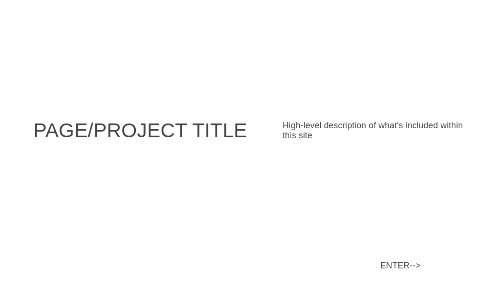
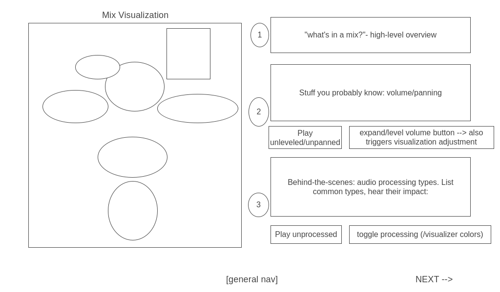
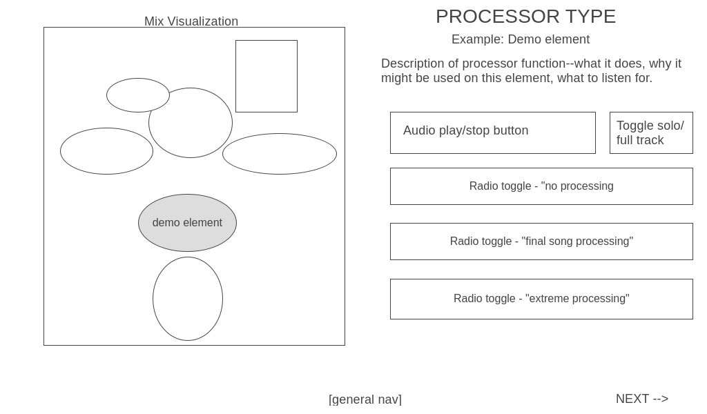

## Background

    Pretty much everyone enjoys music, but most people know little if anything about how music is produced. 
    The functions of microphones, instruments, and performers are all pretty self-explanatory, but even many 
    music enthusiasts wouldn't be able to tell you what a compressor does or the difference between a reverb 
    and a delay in the context of music production. The goal of this project is to teach anyone interested in 
    the process of how music gets made about some of the tools producers use when turning raw recorded performance 
    into a finished, radio-ready track. 
    
    By providing an engaging, responsive interface to experiment with effects of various types of processing 
    in-context and in real time, this project will allow users to develop some hands-on knowledge of the 
    music-making process that will hopefully enhance their understanding and appreciation for all the work that 
    goes into making their favorite songs sound the way they sound from both a technical and artistic standpoint.    

## Functionality & MVPs

In "Watch That Mix!", users will be able to:

- Play and pause audio clips that will loop until stopped
- Change qualities of the sound they're listening to in real time
- A/B the difference between a set of raw tracks and a fully-mixed arrangement
- Hear the effects a variety of types of processing have on elements of a song, both isolated and in-context
- Navigate between sections of the interactive experience without having to reload their browser

In addition, this project will include:

- This highly-informational README document
- Dynamically-animated transitions between display states (e.g. slide changes, mix element highlighting)
- Intuitive visualizations to help focus the user's attention for a more engaging experience
- A major sense of accomplishment on behalf of its author if/when he manages to get all of the above done

## Wireframes

###             Initial Landing Page:

- Landing page will give some background on what the user will encounter within the project and will have a button to move to the first slide

###             Introduction Page:

- The opening page will introduce the concept of a "mix" and the mix visualization format
- Will include the first two demos, which between them will show the effects of panning, volume, and full individual processing across all tracks
- Sections will "enter" the page via animation as indicated by the numbered ovals
- General nav at the bottom of the page will allow user to jump between sections

###             Processor demos:

- Slides for each processor type will include a visualization highlighting the element being used for this processor demo
- Users can play/pause looped audio, toggling what they hear between a single track or the full song and between different levels of processing for that track
- Processors are planned to include: EQ, compression, saturation/distortion, modulation, pitch shift, and spatial effects (reverb or delay) 

## Technologies, Libraries, & APIs

This project will be implemented using:

- The Web Audio API to load and control audio elements and playback
- Webpack to bundle JS code
- Babel to transpile JS code
- npm to manage dependencies
- D3 (Data-Driven Documents) API to enable dynamic mix visualizations 

## Implementation Timeline

#### Friday
 
 - ~~Set up project structure/skeleton with webpack; test that it's working~~
 - ~~Begin familiarization with the Web Audio API~~
 - ~~Get a prototype button running that can play/pause audio~~
 - ~~Get prototype button to loop audio~~
 - ~~Get protoype button to live-swap audio from two sources~~

#### Saturday/Sunday
 
 - Assemble necessary audio resources. These will be approximately 15-second clips, comprising 4 intro slide clips and 6 clips for each processor slide for an estimated 34-40 clips depending on processor categorization. These will need to be pulled from old pro tools sessions, ~~and for variety some will need to be cleared for use with the artists.~~ (PARTIALLY DONE)
 - Implement ~~player~~/toggle buttons functionality
 - Begin familiarization with D3 API, determine steps needed to create and animate mix visualization displays

#### Monday

 - Write in-page copy
 - Have text and buttons displayed and arranged correctly
 - Set up nav bar/"next" buttons
 - Begin CSS styling for site

#### Tuesday

 - Create mix visualizers, add them to slides
 - Use D3 to add dynamic behavior to visualizers
 - Determine which bonus features are doable within remaining time, if any
 

#### Wednesday

 - Complete CSS styling for site
 - Misc. bug fixes/flair additions (animations, scroll/mouse interactions, etc.)
 - Third-party review/testing (i.e. get a friend to try it out and offer feedback)
 - Add any feasible bonus features

#### Thursday

 - Spellcheck
 - Update documentation

## Bonus Features

 - Less-essential processors (pitch shift), additional processing options within individual processors (different types of modulation, saturating groups of tracks)
 - Advanced processing types (pitch correction, sample triggers, *parallel compression*)
 - __SUPER DUPER BONUS:__ bonus page with interactive mixer, including faders for individual song elements that control track volume and panning 